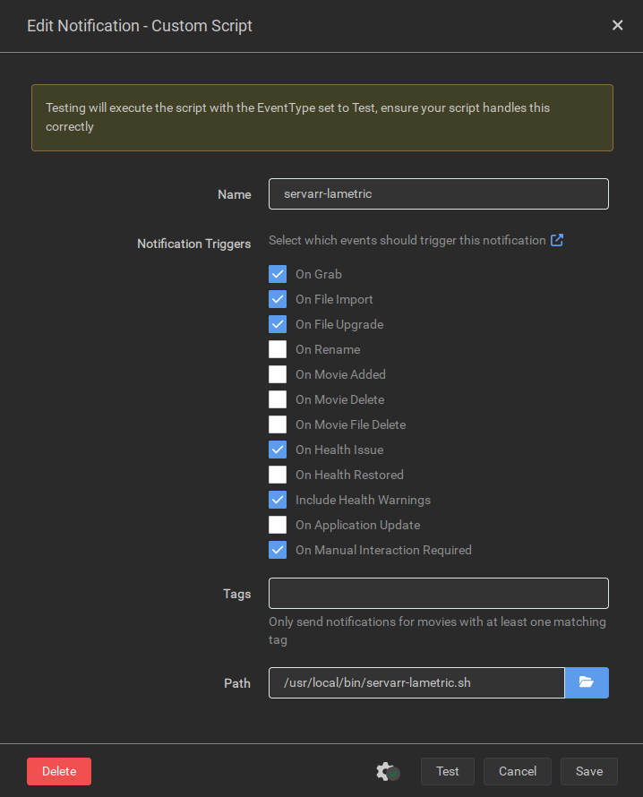

# servarr-lametric

<div align=center>

</div>

## About

servarr-lametric is a [Docker Mod](https://github.com/linuxserver/docker-mods) designed for the LinuxServer.io Docker containers for the *Arr suite of applications. It uses the apps' 'Custom Script' connection to send various notifications to a LaMetric TIME device in your local network.

> [!NOTE]
> The script currently only supports Linux.

Application | Supported
----------- | ---------
Sonarr      |     ✅
Radarr      |     ✅
Readarr     |     ✅
Lidarr      |     ❌
Whisparr    |     ❌
Prowlarr    |     ❌

## Installation

### Using the Docker Mod

1. Set up your container with all the settings using your preferred method.
  
2. Add the `DOCKER_MODS=ghcr.io/marshdeer/servarr-lametric:latest`, `LAMETRIC_API=LAMETRIC_API_KEY` and `LAMETRIC_IP=LAMETRIC_IP>` environment variables to your desired container.
   
    - <details>
      <summary>Docker Compose example</summary>

       ```yaml
      services:
        radarr:
          image: lscr.io/linuxserver/radarr
          container_name: radarr
          environment:
            - PUID=1000
            - PGID=1000
            - TZ=Antarctica/South_Pole
            - DOCKER_MODS=ghcr.io/marshdeer/servarr-lametric:latest
            - LAMETRIC_API=LAMETRIC_API_KEY
            - LAMETRIC_IP=LAMETRIC_IP
          volumes:
            - /path/to/data:/config
            - /path/to/movies:/movies
            - /path/to/downloadclient-downloads:/downloads
          ports:
            - 7878:7878
          restart: unless-stopped
       ```  

      </details>

    - <details>
      <summary>Docker Run example</summary>

       ```
       docker run -d \
         --name=radarr \
         -e PUID=1000 \
         -e PGID=1000 \
         -e TZ=Antarctica/South_Pole \
         -e DOCKER_MODS=ghcr.io/marshdeer/servarr-lametric:latest \
         -e LAMETRIC_API=LAMETRIC_API_KEY \
         -e LAMETRIC_IP=LAMETRIC_IP \
         -p 7878:7878 \
         -v /path/to/data:/config \
         -v /path/to/movies:/movies \
         -v /path-to-downloadclient-downloads:/downloads \
         --restart unless-stopped \
         lscr.io/linuxserver/radarr
       ```  

      </details>

3. Start the container.

4. Add a custom script from the *Arr application's "Connection" page.
   1. Select your desired notification triggers.  
   2. Type `/usr/local/bin/servarr-lametric.sh` into the field labeled **"Path"**.
   3. Click the "Test" button and make sure your LaMetric device shows the test notification correctly.
    
   - <details>
     <summary> Screenshot </summary>
    
     
   
     </details>

> [!TIP]
> You can find your device's IP address in the LaMetric app's settings.  
> You can find your device's API key via the [LaMetric Developer Portal](https://developer.lametric.com/user/devices) (any device) or the LaMetric app (2022+ devices).

> [!IMPORTANT]
> Don't forget to set `LAMETRIC_API` and `LAMETRIC_IP`! The script will not work if they are not set correctly.

## Removal

To completely remove the mod:

1. Delete the "Custom Script" connection you created in the *Arr application's _Settings > Connect_ screen.
2. Stop and delete the application's Docker container.
3. Remove the `DOCKER_MODS`, `LAMETRIC_API` and `LAMETRIC_IP` environment variables from your `docker-compose.yaml` file. (Or don't add them when you next use `docker run` to re-create the *Arr application's container)
